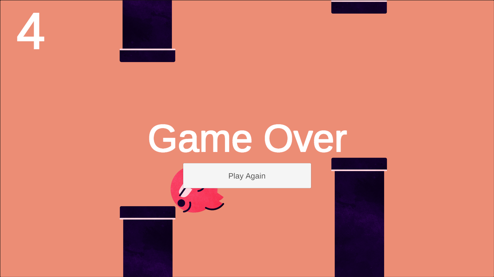

# Flapy Bird Game

## Game Link
You can play the game <a href="https://ariktheone.github.io/Flappy-Bird/" target="_blank">here</a>.

## Screenshots

## Description
Flapy Bird is a simple yet addictive browser-based game inspired by the classic "Flappy Bird". The objective of the game is to navigate a bird through a series of pipes without colliding with them. Each successful pass through a set of pipes earns the player one point. The game ends if the bird collides with a pipe or the ground.

## Gameplay
- Use the spacebar or left mouse button to make the bird flap its wings and ascend.
- Avoid colliding with the pipes and the ground.
- Each successful pass through a set of pipes earns one point.
- The game ends if the bird collides with a pipe or the ground.

## Features
- Simple and intuitive controls.
- Score tracking to keep track of your progress.
- Engaging gameplay that tests your reflexes and timing.

## How to Play
1. Open the `index.html` file in your web browser.
2. Press the spacebar to make the bird flap its wings.
3. Navigate the bird through the pipes by timing your jumps carefully.
4. Earn points for each successful pass through a set of pipes.
5. Challenge yourself to beat your high score!

## Technologies Used
- HTML5
- CSS3
- JavaScript

## Credits
- This game is inspired by the classic "Flappy Bird" game.
- Built using the Unity game engine for WebGL.

## Author
Arijit Mondal

[GitHub](https://github.com/ariktheone) | [LinkedIn](https://www.linkedin.com/in/arijitmondal30/)

